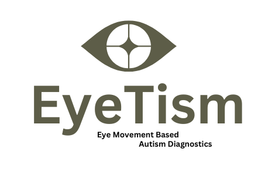
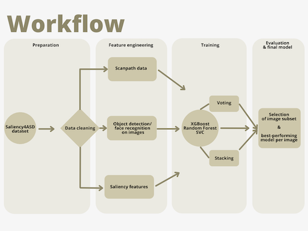

# EyeTism - Eye Movement Based Autism Diagnostics
##### Authors: Elena Ockfen, Dennis Dombrovskij, Mariano Santoro, Stefan Schlögl, Adam Zabicki
----


This repository contains the work of the Capstone project "EyeTism - Eye Movement Based Autism Diagnostics", developed within the intensive _Data Science Bootcamp_ provided by [neuefische GmbH](https://neuefische.de). 

# Description

Our "EyeTism" project focussed on the development of a tool for diagnosis of Autism Spectrum Disorder (ASD) in children within the age range of 8 - 15 years old. ASD is a developmental disability with effects on social interaction and learning. Hence, early diagnosis of affected children is crucial for child development. Although individuals with ASD often exhibit distinct gaze behavior compared to typically developing (TD), ASD detection still remains challenging. Our tool employs machine learning on eye tracking data from high-functioning ASD and TD children to build an integrative tool for pediatricians responsible for diagnosing ASD based on visual attention patterns of patients on a selected subset of images. 

# Data source

Gaze behaviors of 14 patients with ASD and 14 TD were analyzed when exposed to diverse visual stimuli. 300 images composed the Saliency4ASD dataset (https://saliency4asd.ls2n.fr/datasets/) featuring diverse scenes:
  - 40 images featuring animals
  - 88 with buildings or objects
  - 20 depicting natural scenes
  - 36 portraying multiple people in one image
  - 41 displaying multiple people and objects in one image
  - 32 with a single person
  - 43 with a single person and objects in one image

> _Reference dataset: H. Duan, G. Zhai, X. Min, Z. Che, Y. Fang, X. Yang, J. Gutiérrez, P. Le Callet, “A Dataset of Eye Movements for the Children with Autism Spectrum Disorder”, ACM Multimedia Systems Conference (MMSys’19), Jun. 2019_

# Roadmap - from data to final models



### 0. clone this repo

```terminal
git clone xxx
cd EyeTism
```

### 1. Python Environment 

- Open the terminal

- Depending on how you manage your virtual environments, either install it via _conda_

```terminal
conda env create -f environment.yml
```

- or via _venv_

```terminal
pyenv local 3.11.3
python -m venv .venv
source .venv/bin/activate
pip install --upgrade pip
pip install -r requirements.txt 
```

### 2. Extract data from .zip files

- Download the following .zip archives and store them in the `/source` folder:
   - [Saliency4ASD Dataset](https://github.com/eockfen/EyeTism/releases/download/v0.1.0/Saliency4ASD.zip)
   - [Saliency Predictions](https://github.com/eockfen/EyeTism/releases/download/v0.1.0/saliency_predictions.zip)
   - [SAM original](https://github.com/eockfen/EyeTism/releases/download/v0.1.0/SAM_original.zip)

- Run python script in `/scripts` folder:

``` terminal
cd ./scripts
python unzip_data.py
```

- This will extract full `Saliency4ASD` dataset, as well as the saliency predictions of the 300 images for three different visual attentive models: `DeepGazeIIE` [link](link), `SAM_ResNET` [link](link), and `SAM_VGG` [link](link).

**_Re-do saliency predictions_**

- The extracted zip files contain the already generated saliency maps predicted by DEEPGAZEIIE and SAM, but your are able to reproduce our steps we did to obtain these maps.

- Originally downloaded saliency prediction maps of the _SAM_ model had different names as the images in the _Saliency4ASD_ dataset, therefore the following steps were performed:

    - Matching differently named files to the salency4asd files 
    - Renaming / copying the saliency predicted maps

- DeepGazeIIE predictions were done by implementing their actual model. 

- To re-do these steps, run the following code:

``` terminal
cd ./scripts
python unzip_data.py sam
python prepare_saliency_maps.py sam
python prepare_saliency_maps.py dg
```

#### 3. Extract all features

- Check out and run the `extract_features.iypnb` notebook in the `/notebooks` folder.

- Extracted features will be saved in `/data/df_deep_sam.csv` file. This process can approximately take two hours.

After running the notebook, three outputs are generated:

1. all individual scanpaths are overlayed onto the stimuli images. 

2. all detected objects (whose probability scores will be saved in a `.txt` file) and faces are overlayed onto the stimuli images. 

3. individual scanpaths, detected objects and faces are overlayed onto the stimuli images. 

- Outputs will be saved in `/data/obj_detection` folder and in the `/data/individual_scanpaths` folder, respectively 


### 4. Exploratory Data Analysis

_will be provided_

### 5. Baseline model

Check out the notebook `baseline.iypnb` in the `/notebooks` folder to run the baseline model. 

### 6. Classifiers construction 

The final models were selected after evaluating the 30-image-test-set by defining the best model-image-pairs, as detailed in the notebooks in the `/modeling` folder

The results were generated as reported:

1. In notebook `create_basemodel_pipelines.ipynb`
    - all models use a different set of features, therefore pipelines are built to generate stacking and voting classifiers
    - this results in uncalibrated basemodels of `RF`, `XGBoost` and `SVC`, which are saved in `/models/uncalibrated_pipelines/<MODEL>_uncalib.pickle`
  
2. In notebook `calib_RF_XGB_SVC_threshold.ipynb`
    - models mentioned in 1. are calibrated
    - _threshold_ analysis is performed to find the optimal decision thresholds for each model in order to maximize f1 score 
    - calibrated models are saved in `/models/calibrated/<MODEL>_calib.pickle`

3. In notebook `voting_RF_XGB_SVC_threshold.ipynb`
    - voting classifier is built on top of the previous calibrated models (`RF`, `XGBoost` and `SVC`)
    - voting model is saved in `/models/calibrated/VTG_calib.pickle`

4. In notebook `stacking_<MODEL>_calib.ipynb`
    - stacking classifiers are built for 4 different _final estimators_ 
      - Logistic regression (LR)
      - K-nearest neighbors (KNN)
      - Light gradient boosting machine (LGBM)
      - Naive Bayes (NB)
    - base estimators are the calibrated basemodels `RF`, `XGBoost` and `SVC`
    - stacking models are saved in `/models/calibrated/stacking_<MODEL>_calib.pickle`

5. In notebook `stacking_thresholding.ipynb`
   - _Threshold_ analysis is performed for the four stacking models


## 7. Final evaluation on 30 test images

The 8 models developed are then evaluated on our 30-image-test-set as reported in the notebook `FINAL_EVALUATION.ipynb`


## `main/` navigator  
---

`/CNN`
  - This folder contains the work done for the CNN modelling part (not integrated in the workflow)
  - `README.md` can navigate you through its content

`/Dashboard`
- This folder contains...

`/images`
- In this folder you will find:
    - final set.png contains the final set of images 
    - test_set.png contains set of images used for generating the predictions of the models
    - val_set.png

`/modeling`
- In this folder you will find: 
    - the subfolder `/dev` where several models were developed, trained and tested
    - the notebooks generated for the 8 developed models, for the pipelines to realize voting and stacking classifiers and for the final evaluation of the models `FINAL_EVALUATION.ipynb`

`/models`
- In this folder you find the subfolders:
    - `/calibrated` contains the calibrated models as `pickle`files
    - `/dev`contains subfolders with all the models generated during the development, finetuning and optimization phase as `pickle`files
    - `/mediapipe` contains mediapipe models
    - `/uncalibrated_pipelines` contains uncalibrated models as `pickle`files

`/notebooks`
- In this folder you find two notebooks generated for the baseline modelling part and the extraction of the features

`/scripts`
- This folder contains...
      


## Dashboard
----

Find here the link our tool: 

## Presentation
----

Find here the presentation done at the graduation event of the Neuefische Data Science bootcamp ([EyeTism presentation](EyeTism_presentation.pdf)))

## Acknowledgements
All authors express their profound gratitude to the coaches and the organization of **Neuefische GmbH**
