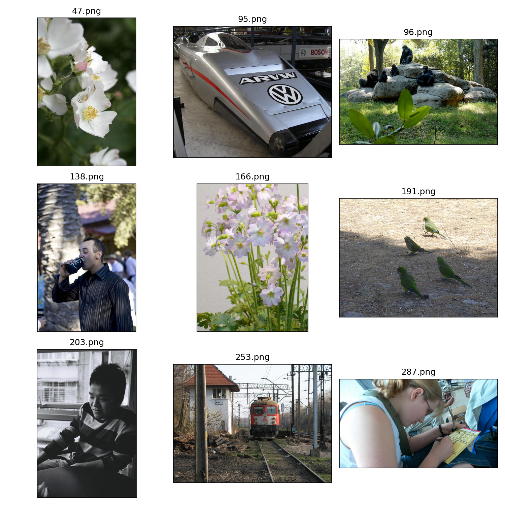

# 1. install environment

- conda

``` terminal
conda env create -f environment.yml
````

- venv & pip

```terminal
pyenv local 3.11.3
python -m venv .venv
source .venv/bin/activate
pip install --upgrade pip
pip install -r requirements.txt 
```

# 2. extract data from zip files
run python script in scripts folder:

``` terminal
cd ./scripts
python unzip_data.py
```

this will extract the `Saliency4ASD` dataset, as it was provided to the competitioners during the challenge, as well as the saliency predictions of the 300 images for three different visual attentive models: `DeepGazeIIE`, `SAM_ResNET`, and `SAM_VGG`.

## 2a. re-do saliency predictions 
- the saliency predictions from the SAM model, which were downloaded from their repository, were unfortunatelly not named like the images in the Saliency4ASD dataset. hence we needed to match their differently named files to the salency4asd files and rename/copy the saliency predictions in a next step.
- the DeepGazeIIE predictions were done by implementing their actual model

in order to re-calculate and re-sort the saliency prediction images, please run the following code:

``` terminal
cd ./scripts
python unzip_data.py sam
python prepare_saliency_maps.py sam
python prepare_saliency_maps.py dg
```

# 3. extract all features

check out and run the `extract_features.iypnb` notebook in the `/notebooks` folder. extracted features will be saved in `/data/df_deep_sam.csv` file. Be aware: this will take a while (approx. 2h) to process.

### additional output
runnig the notebook, additional output is generated:
- all individual scanpaths overlayed onto the stimuli images
- all detected objects (probability scores will be saved in a text file) and faces, also overlayed onto the stimuli images
- combination of the above

these will be saved into the `/data/obj_detection`, respectively `/data/individual_scanpaths`, folder. 


# 4. EDA


# 5. baseline model

check out and run the `baseline.iypnb` notebook in the `/notebooks` folder. 

# 6. building classifiers
we tried a lot of models and optimized them in various ways. if you are interested in all this work, check out the notebook in the `/modeling/dev` folder.

how we obtained the final models, which were evaluated on the 30-image-test-set to define model-image-pairs, is described in the notebooks in the `/modeling` folder. to reproduce our results, follow these steps:

1. `create_basemodel_pipelines.ipynb`
    - since all models used a different set of features in the end, pipelines were needed to make stacking/voting possible
    - this notebook results in uncalibrated basemodels of `RF`, `XGBoost` and `SVC`, which are saved in `/models/uncalibrated_pipelines/<MODEL>_uncalib.pickle`
  
2. `calib_RF_XGB_SVC_threshold.ipynb`
    - this will calibrate the afore mentioned models
    - furthermore, a _threshold_ analysis is performed to find the optimal decision thresholds for each model, in order to maximize f1 
    - calibrated models are saved in `/models/calibrated/<MODEL>_calib.pickle`

3. `voting_RF_XGB_SVC_threshold.ipynb`
    - build a voring classifier on top of the previous calibrated models (`RF`, `XGBoost` and `SVC`)
    - voting model is saved in `/models/calibrated/VTG_calib.pickle`

4. `stacking_<MODEL>_calib.ipynb`
    - stacking classifiers are build for 4 different _final estimators_ 
      - logistic regression (LR)
      - k nearest neighbors (KNN)
      - light gbm (GBM)
      - naive bayes (NB)
    - base estimators are the calibrated basemodels `RF`, `XGBoost` and `SVC`
    - stacking models are saved in `/models/calibrated/stacking_<MODEL>_calib.pickle`

5. `stacking_thresholding.ipynb`
   - _threshold_ analysis is also performed for the four stacking models


# 7. final evaluation on 30 test images

Finally, we evaluate the 8 models on our 30-image-test-set. See `FINAL_EVALUATION.ipynb` for the results.

